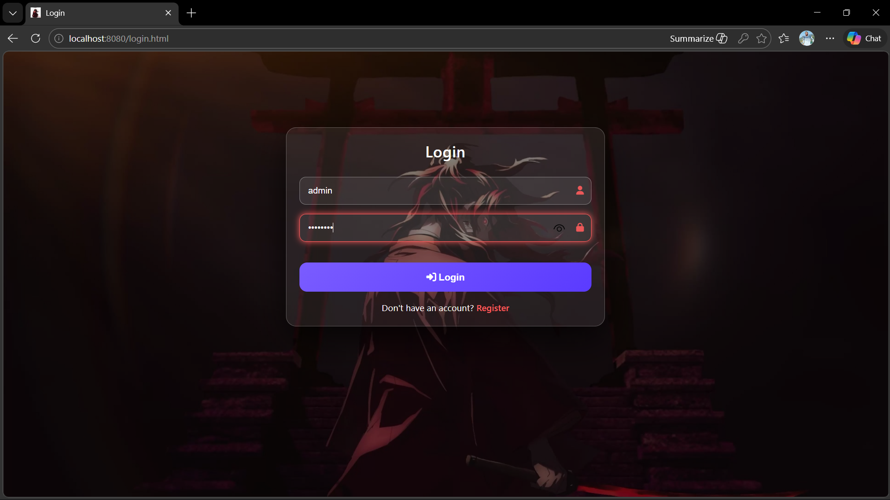
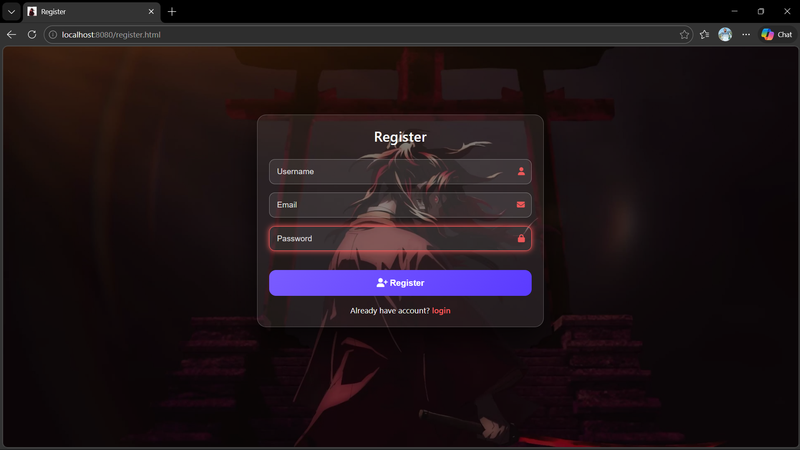

# Task Management System – Full Stack Web Application (Spring Boot + JavaScript)

---

## 🌍 Live Application

Web UI:
[Open Task Manager Web App](https://render-backend-service.onrender.com)

Swagger UI:
[Open Swagger UI](https://render-backend-service.onrender.com/swagger-ui/index.html)

---

## 🎯 Objective

The **Task Manager System** is a full stack web application developed using **Spring Boot REST APIs** and a **JavaScript-based frontend**.

The system allows users to manage their daily tasks by creating, updating, viewing, and deleting tasks.
Administrators can monitor users and their tasks.

---

# 🛠 Technologies Used

* **Language:** Java
* **Backend:** Spring Boot
* **Frontend:** HTML, CSS, JavaScript
* **Security:** Spring Security with JWT Authentication (JWT Filter)
* **Database:** PostgreSQL
* **ORM:** Spring Data JPA / Hibernate
* **Build Tool:** Maven
* **API Testing:** Postman
* **Architecture:** Controller → Service → Repository → Database

---

# 👤 User Roles

## Admin

* Login authentication
* View all users
* View tasks of any specific user

## User

* Register account
* Login to system
* Create tasks
* View all personal tasks
* Update tasks
* Delete tasks

---

# ✨ Features

## Authentication

* User registration
* User login with JWT authentication
* Secure API access using Bearer token
* Role-based authorization
* JWT token stored in browser localStorage

---

## Task Management

* Add new task
* View tasks
* Update task details
* Delete tasks
* Task status management (PENDING / IN_PROGRESS / DONE)
* Task selection in UI
---

# 📡 Backend API Endpoints

* **Base URL:** https://render-backend-service.onrender.com

## Authentication APIs

* **POST** `/api/v1/auth/register` – Register new user
* **POST** `/api/v1/auth/login` – Login and receive JWT token

---

## Task APIs

* **POST** `/api/v1/tasks/create` – Create new task
* **GET** `/api/v1/tasks/all` – Get all tasks for logged in user
* **PUT** `/api/v1/tasks/update/{id}` – Update task
* **DELETE** `/api/v1/tasks/delete/{id}` – Delete task

---

## Admin APIs

* **GET** `/api/v1/admin/users` – Get all users
* **GET** `/api/v1/admin/user/{id}/tasks` – Get tasks of a specific user

---

# 🗄 Data Model

## User

id | username | email | password | role

---

## Task

taskId | title | description | status | userId

---

# ✅ Prerequisites

Make sure the following software is installed:

* Java JDK 17+
* PostgreSQL Server
* Maven
* IntelliJ IDEA / Eclipse IDE
* Web Browser

---

# 🚀 How to Run the Project

Follow the steps below to run the Task Manager System on your local machine.

---

## 📥 Step 1: Clone the Repository

```bash id="n3h6li"
git clone https://github.com/your-username/task-manager-system.git
```

---

## 📂 Step 2: Import Project into IDE

1. Open IntelliJ IDEA / Eclipse IDE
2. Click **File → Open / Import**
3. Select the cloned project folder

---

## 🗄 Step 3: Setup PostgreSQL Database

```sql id="j63cyr"
CREATE DATABASE task_manager;
```

---

## ⚙ Step 4: Configure Database Connection

Update **application.properties**

```properties id="2ysb8c"
spring.datasource.url=jdbc:mysql://localhost:3306/task_manager
spring.datasource.username=your_username
spring.datasource.password=your_password

spring.jpa.hibernate.ddl-auto=update
spring.jpa.show-sql=true
```

---

## 🔌 Step 5: Load Maven Dependencies

Right click project → Maven → **Update Project**

---

## ▶ Step 6: Run the Application

Run the Spring Boot main class:

```id="h3pry1"
TaskManagerApplication.java
```

Backend runs at:

```
https://render-backend-service.onrender.com
```

---

## 🌐 Step 7: Frontend Run Step

Open in browser:

```
https://render-backend-service.onrender.com/login.html
```

---

# 🔐 Authentication Flow

```
Register → Login → JWT Token Generated
         ↓
Token stored in localStorage
         ↓
Token sent in Authorization header
         ↓
Backend validates JWT
```

Example header:

```
Authorization: Bearer <JWT_TOKEN>
```

---

# ⚙ Automatic Setup

The application automatically performs the following setup when started for the first time.

### 1️⃣ Automatic Database Table Creation

Spring Boot uses **Hibernate JPA** to automatically create database tables.

Make sure the following property exists in `application.properties`:

```properties
spring.jpa.hibernate.ddl-auto=update
```

When the application starts:

* Required tables will be automatically created in the database.
* No manual SQL scripts are required.

---

### 2️⃣ Default Admin Creation

When the application starts for the first time, a **default admin user is automatically created** if it does not already exist.

Default Admin Credentials:

```
Username: admin
Password: admin123
Role: ADMIN
```

This allows administrators to login immediately and manage the system.

---

### 3️⃣ Database Setup

Before running the application, create the database:

```sql
CREATE DATABASE task_manager;
```

After starting the application:

* Tables will be created automatically.
* Default admin user will be inserted automatically.

---

## Application User Interface Sample

### Login Page


### Register Page

